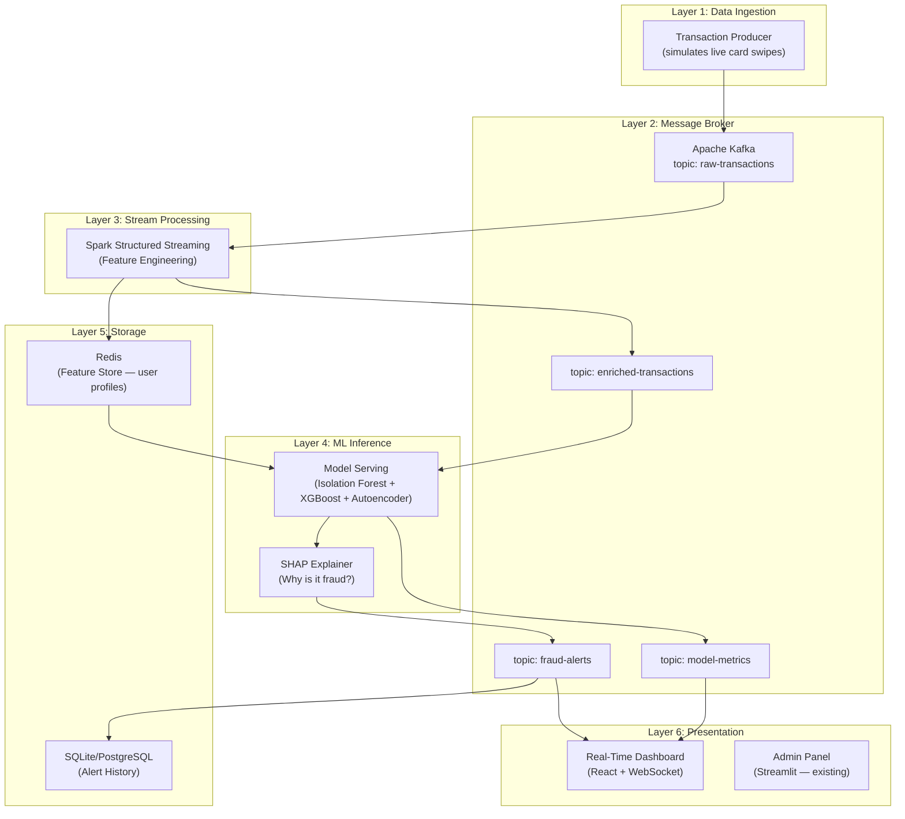
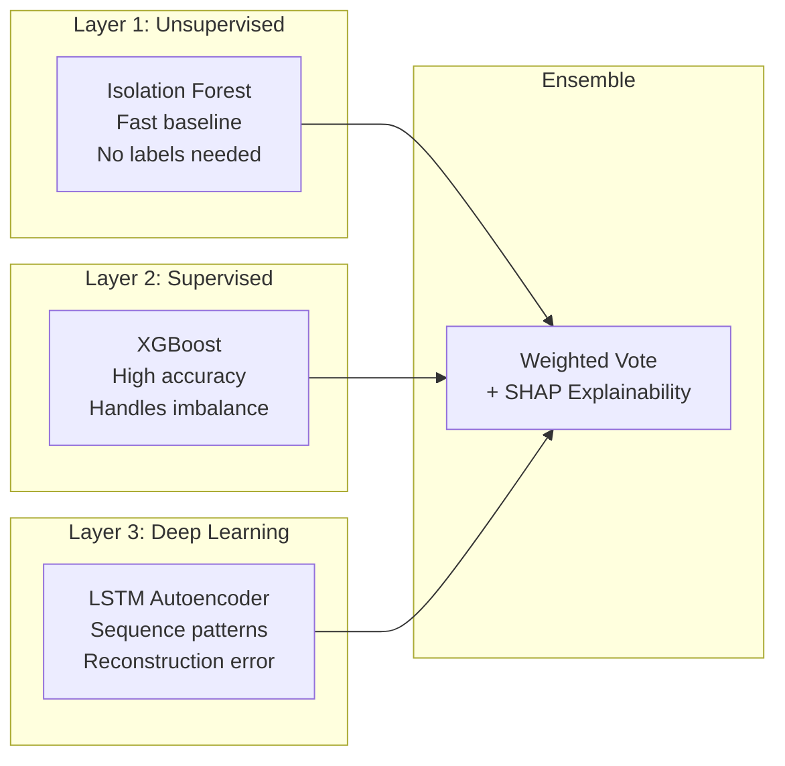

# Real-Time Fraud Detection System — Implementation Plan

> A production-grade, real-time fraud detection pipeline built on top of your existing Dynamic Topic Management & Streaming Analytics Framework, combining **Big Data streaming (Kafka + Spark)**, **ML (Isolation Forest → XGBoost → Autoencoder)**, and **Explainable AI (SHAP)**.

---

## 1. The Big Picture

We're not building a Jupyter notebook classifier — we're building an **end-to-end real-time ML system** with 6 layers:



### How It Extends Your Existing Framework

| Existing Component | How It's Reused | What Changes |
|---|---|---|
| [admin_service.py](file:///c:/Users/PAVAN%20K%20AITHAL/OneDrive/Desktop/PROJECT/Dynamic%20Topic%20Management%20and%20Streaming%20Analytics%20Framework/Broker_Admin/admin_service.py) | Topic lifecycle management for new fraud topics | Add fraud-specific endpoints (alert stats, model metrics) |
| [streamlit_admin.py](file:///c:/Users/PAVAN%20K%20AITHAL/OneDrive/Desktop/PROJECT/Dynamic%20Topic%20Management%20and%20Streaming%20Analytics%20Framework/Broker_Admin/streamlit_admin.py) | Admin dashboard base | Extend with fraud monitoring, model performance tabs |
| [producer/](file:///c:/Users/PAVAN%20K%20AITHAL/OneDrive/Desktop/PROJECT/Dynamic%20Topic%20Management%20and%20Streaming%20Analytics%20Framework/producer/) | Multi-threaded producer pattern | New `fraud_producer.py` replays credit card transactions |
| [Consumer/kafka_consumer.py](file:///c:/Users/PAVAN%20K%20AITHAL/OneDrive/Desktop/PROJECT/Dynamic%20Topic%20Management%20and%20Streaming%20Analytics%20Framework/Consumer/kafka_consumer.py) | Dynamic subscription pattern | Dashboard subscribes to `fraud-alerts` topic |
| [Consumer/frontend/](file:///c:/Users/PAVAN%20K%20AITHAL/OneDrive/Desktop/PROJECT/Dynamic%20Topic%20Management%20and%20Streaming%20Analytics%20Framework/Consumer/frontend/) | React + Vite frontend | Build new fraud dashboard with live charts |
| [config.json pattern](file:///c:/Users/PAVAN%20K%20AITHAL/OneDrive/Desktop/PROJECT/Dynamic%20Topic%20Management%20and%20Streaming%20Analytics%20Framework/producer/data/dataset.config.json) | Topic-to-fields mapping | New config for fraud transaction schema |

---

## 2. Dataset Details

### Primary Dataset: Kaggle Credit Card Fraud Detection

| Property | Detail |
|---|---|
| **Source** | [Kaggle: Credit Card Fraud Detection](https://www.kaggle.com/datasets/mlg-ulb/creditcardfraud) |
| **Records** | 284,807 transactions over 2 days |
| **Fraudulent** | 492 (0.172%) — **extremely imbalanced** |
| **Features** | `Time`, `V1`–`V28` (PCA-transformed), `Amount`, `Class` |
| **Size** | ~150 MB |
| **License** | Open Database License (ODbL) |

> [!IMPORTANT]
> Features `V1`–`V28` are already PCA-transformed by the original researchers for privacy. `Time` is seconds elapsed from the first transaction. `Amount` is the transaction amount. `Class` is `0` (legit) or `1` (fraud).

### Secondary Dataset (for richer features): IEEE-CIS Fraud Detection

| Property | Detail |
|---|---|
| **Source** | [Kaggle: IEEE-CIS Fraud Detection](https://www.kaggle.com/c/ieee-fraud-detection) |
| **Records** | 590,540 card-not-present transactions |
| **Fraudulent** | 20,663 (3.5%) — much less imbalanced than Credit Card dataset |
| **Features** | ~431 features across two tables joined by `TransactionID` |
| **Key Feature Groups** | `TransactionAmt`, `ProductCD`, `card1–card6` (card info), `addr1/addr2`, `P_emaildomain`/`R_emaildomain`, `C1–C14` (counts), `D1–D15` (timedeltas), `M1–M9` (matches), `V1–V339` (Vesta engineered), `id_01–id_38` (device/browser) |
| **Advantage** | Raw features (not PCA'd) → better for explainability, real categorical features |
| **Size** | ~1.3 GB |
| **Note** | Often reduced to ~67 features via feature selection; many features anonymized |

### Synthetic Dataset (for velocity/geo features): PaySim

| Property | Detail |
|---|---|
| **Source** | [Kaggle: PaySim](https://www.kaggle.com/datasets/ealaxi/paysim1) |
| **Records** | 6,362,620 transactions (~470 MB) |
| **Fraudulent** | 8,213 (0.13%) |
| **Features** | `step` (time unit, 1hr each), `type` (CASH-IN/CASH-OUT/DEBIT/PAYMENT/TRANSFER), `amount`, `nameOrig`/`nameDest`, `oldbalanceOrg`/`newbalanceOrig`, `oldbalanceDest`/`newbalanceDest`, `isFraud`, `isFlaggedFraud` |
| **Advantage** | Large enough to simulate realistic streaming load, has user IDs for behavioral features |
| **⚠️ Caveat** | Balance columns may cause data leakage; fraud only in TRANSFER and CASH-OUT types |

> [!TIP]
> **Recommended approach**: Start with the **Kaggle Credit Card** dataset (simpler, proven). Once the pipeline works, swap in **IEEE-CIS** for richer explainability features. Use **PaySim** to stress-test throughput.

---

## 3. ML Model Strategy — Triple-Layer Detection

We build **three models** of increasing complexity, each adding value:



### Model 1: Isolation Forest (Unsupervised Baseline)

```
Purpose:       First-pass anomaly filter — no labels needed
Training:      On all data (or just non-fraud)
Inference:     Anomaly score per transaction
Key Param:     contamination=0.002 (match fraud rate)
Output:        anomaly_score ∈ [-1, 1]
Strengths:     Fast, interpretable, no label dependency
```

### Model 2: XGBoost Classifier (Supervised Workhorse)

```
Purpose:       High-accuracy binary classification
Training:      On labeled data with class imbalance handling
Key Techniques:
  - scale_pos_weight = (count_legit / count_fraud) ≈ 577
  - OR: SMOTE oversampling of minority class
  - Stratified K-Fold cross-validation
Metrics:       Precision, Recall, F1, AUPRC (not just accuracy!)
Output:        fraud_probability ∈ [0, 1]
Strengths:     Best performance, feature importance built-in
```

> [!WARNING]
> **Never use Accuracy** as a metric for fraud detection. With 99.8% non-fraud, a model that always says "not fraud" gets 99.8% accuracy but catches zero fraud. Use **AUPRC (Area Under Precision-Recall Curve)** and **F1-Score** instead.

### Model 3: LSTM Autoencoder (Deep Learning)

```
Purpose:       Detect novel/unseen fraud patterns via reconstruction error
Architecture:
  - Encoder: Input(30) → Dense(14, relu) → Dense(7, relu)
  - Decoder: Dense(7, relu) → Dense(14, relu) → Dense(30, sigmoid)
Training:      ONLY on non-fraudulent transactions (Class == 0)
Inference:     reconstruction_error = MSE(input, reconstructed)
Threshold:     Set at 97th percentile of non-fraud reconstruction errors
Output:        reconstruction_error (high = anomalous)
Strengths:     Catches unknown attack patterns, no labeled fraud needed
```

### Ensemble Strategy

```python
# Pseudo-code for ensemble scoring
def ensemble_predict(transaction_features):
    iso_score   = isolation_forest.decision_function(features)    # [-1, 1]
    xgb_prob    = xgboost_model.predict_proba(features)[:, 1]     # [0, 1]
    ae_error    = autoencoder_reconstruction_error(features)       # [0, ∞)

    # Normalize all to [0, 1]
    iso_norm    = normalize(iso_score)
    ae_norm     = normalize(ae_error)

    # Weighted ensemble
    final_score = 0.2 * iso_norm + 0.5 * xgb_prob + 0.3 * ae_norm

    # SHAP explanation (on the XGBoost prediction)
    explanation = shap.TreeExplainer(xgboost_model).shap_values(features)

    return {
        "fraud_score": final_score,
        "is_fraud": final_score > 0.5,
        "model_scores": { "isolation_forest": iso_norm, "xgboost": xgb_prob, "autoencoder": ae_norm },
        "explanation": top_k_shap_features(explanation, k=5)
    }
```

---

## 4. Feature Engineering — What Makes This "Big Data"

### Static Features (from dataset)
- `V1`–`V28` (PCA components), `Amount`, `Time`

### Engineered Real-Time Features (computed in Spark Structured Streaming)

| Feature | Window | Description | Why It Matters |
|---|---|---|---|
| `txn_count_1h` | 1 hour | # of transactions by this user in last hour | Rapid-fire fraud pattern |
| `txn_count_24h` | 24 hours | # of transactions by this user in last 24h | Spending burst detection |
| `avg_amount_1h` | 1 hour | Average transaction amount in last hour | Deviation from norm |
| `max_amount_24h` | 24 hours | Max single transaction in last 24h | Unusually large purchase |
| `amount_zscore` | Rolling | (current_amount - mean) / std for this user | Statistical anomaly |
| `time_since_last_txn` | N/A | Seconds since user's last transaction | Impossible travel / rapid use |
| `amount_ratio` | N/A | current_amount / avg_amount_24h | Spike detection |
| `unique_merchants_1h` | 1 hour | Distinct merchants in last hour | Card testing pattern |
| `is_round_amount` | N/A | Is amount a round number? | Common fraud signal |
| `hour_of_day` | N/A | Hour extracted from timestamp | Night-time fraud |
| `is_weekend` | N/A | Weekend flag | Behavioral shift |

> [!NOTE]
> Since the Kaggle dataset doesn't have `user_id` or `merchant_id`, we'll **synthesize** these by mapping `V1`–`V3` ranges to simulated user IDs. This is a common research technique and lets us demonstrate the full windowed feature engineering pipeline.

---

## 5. Phased Roadmap — File-by-File Plan

### Project Structure (Final State)

```
Dynamic Topic Management and Streaming Analytics Framework/
├── Broker_Admin/                          # ✅ EXISTING (extended)
│   ├── admin_service.py                   # [MODIFY] Add fraud endpoints
│   └── streamlit_admin.py                 # [MODIFY] Add fraud monitoring tabs
│
├── producer/                              # ✅ EXISTING (extended)
│   ├── data/
│   │   ├── creditcard.csv                 # [NEW] Kaggle dataset
│   │   └── creditcard.config.json         # [NEW] Topic-field mapping
│   ├── fraud_producer.py                  # [NEW] Replays transactions as stream
│   ├── ingest_thread.py                   # ✅ EXISTING (reused)
│   ├── publisher_thread.py                # ✅ EXISTING (reused)
│   └── topic_watcher.py                   # ✅ EXISTING (reused)
│
├── stream_processor/                      # [NEW] 🔥 Core ML Pipeline
│   ├── spark_streaming_job.py             # [NEW] Spark Structured Streaming
│   ├── feature_engineering.py             # [NEW] Real-time feature computation
│   └── config.py                          # [NEW] Spark + Kafka config
│
├── ml_models/                             # [NEW] 🧠 Model Training & Serving
│   ├── notebooks/
│   │   ├── 01_eda_and_preprocessing.ipynb # [NEW] Data exploration
│   │   ├── 02_isolation_forest.ipynb      # [NEW] Unsupervised baseline
│   │   ├── 03_xgboost_training.ipynb      # [NEW] Supervised model
│   │   ├── 04_autoencoder_training.ipynb  # [NEW] Deep learning model
│   │   └── 05_ensemble_evaluation.ipynb   # [NEW] Ensemble + SHAP
│   ├── trained_models/
│   │   ├── isolation_forest.joblib        # [NEW] Serialized model
│   │   ├── xgboost_fraud.joblib           # [NEW] Serialized model
│   │   ├── autoencoder.pt                 # [NEW] PyTorch model
│   │   └── scaler.joblib                  # [NEW] Feature scaler
│   ├── model_server.py                    # [NEW] FastAPI model serving
│   ├── ensemble.py                        # [NEW] Ensemble + SHAP logic
│   └── requirements.txt                   # [NEW] ML dependencies
│
├── Consumer/                              # ✅ EXISTING (extended)
│   ├── kafka_consumer.py                  # ✅ EXISTING (reused)
│   ├── alert_consumer.py                  # [NEW] Fraud alert consumer
│   └── frontend/                          # ✅ EXISTING (extended)
│       └── src/
│           ├── App.jsx                    # [MODIFY] Add fraud dashboard route
│           ├── pages/
│           │   ├── TopicManager.jsx       # [NEW] Extracted from current App
│           │   └── FraudDashboard.jsx     # [NEW] 🔥 Real-time fraud viz
│           ├── components/
│           │   ├── LiveTransactionFeed.jsx # [NEW] Scrolling transaction log
│           │   ├── FraudAlertCard.jsx     # [NEW] Detailed fraud alert
│           │   ├── ModelMetricsPanel.jsx  # [NEW] Precision/Recall/F1 live
│           │   ├── ShapExplanation.jsx    # [NEW] SHAP waterfall chart
│           │   └── RiskHeatmap.jsx        # [NEW] Geographic/temporal heatmap
│           └── api.js                     # [MODIFY] Add fraud API calls
│
├── docker/                                # [NEW] 🐳 Containerization
│   ├── docker-compose.yml                 # [NEW] Full stack orchestration
│   ├── Dockerfile.producer                # [NEW]
│   ├── Dockerfile.spark                   # [NEW]
│   ├── Dockerfile.model-server            # [NEW]
│   ├── Dockerfile.admin                   # [NEW]
│   └── Dockerfile.dashboard               # [NEW]
│
└── README.md                              # [NEW] Project documentation
```

---

### Phase 1: Data Pipeline Foundation (Week 1)

> **Goal**: Get transactions flowing through Kafka, viewable in admin dashboard.

#### 1.1 Download and Prepare Dataset

```bash
# Download from Kaggle (requires kaggle CLI)
kaggle datasets download -d mlg-ulb/creditcardfraud
unzip creditcardfraud.zip -d producer/data/
```

#### 1.2 [NEW] `producer/data/creditcard.config.json`

```json
{
  "topics": {
    "raw-transactions": ["Time", "V1", "V2", "V3", "V4", "V5", "V6", "V7",
                          "V8", "V9", "V10", "V11", "V12", "V13", "V14",
                          "V15", "V16", "V17", "V18", "V19", "V20", "V21",
                          "V22", "V23", "V24", "V25", "V26", "V27", "V28",
                          "Amount", "Class"]
  },
  "description": "Credit card transactions for fraud detection"
}
```

#### 1.3 [NEW] `producer/fraud_producer.py`

A specialized producer that:
- Reads `creditcard.csv` row by row
- Assigns synthetic `user_id` and `merchant_id` based on feature clustering
- Adds realistic timestamps (instead of just seconds-from-start)
- Publishes to `raw-transactions` Kafka topic
- Configurable replay speed (1x, 10x, 100x real-time)
- Publishes transaction metadata to Admin API for topic tracking

#### 1.4 [MODIFY] `Broker_Admin/admin_service.py`

Add new endpoints:
- `GET /fraud/stats` — Total transactions processed, fraud count, false positive count
- `GET /fraud/alerts` — Recent fraud alerts with SHAP explanations
- `POST /fraud/feedback` — Human feedback on alerts (was this really fraud?)
- `GET /model/metrics` — Live model performance (precision, recall, F1)

#### Deliverable: Transactions streaming through Kafka, visible in admin panel.

---

### Phase 2: ML Model Training (Week 2)

> **Goal**: Train all three models offline, evaluate, save artifacts.

#### 2.1 [NEW] `ml_models/notebooks/01_eda_and_preprocessing.ipynb`

- Load creditcard.csv
- Visualize class distribution (bar chart showing 492 vs 284,315)
- Correlation heatmap of features
- Distribution plots of `Amount` for fraud vs legit
- Time-of-day analysis
- Standardize features (`StandardScaler` on Amount and Time)
- Train/validation/test split (70/15/15, stratified)

#### 2.2 [NEW] `ml_models/notebooks/02_isolation_forest.ipynb`

- Train `sklearn.ensemble.IsolationForest` with `contamination=0.00172`
- Evaluate with precision, recall, F1, confusion matrix
- Tune `n_estimators`, `max_samples`
- Save model with `joblib`

#### 2.3 [NEW] `ml_models/notebooks/03_xgboost_training.ipynb`

- Handle imbalance: `scale_pos_weight=577`
- Train `xgboost.XGBClassifier` with:
  - `max_depth=6`, `learning_rate=0.1`, `n_estimators=300`
  - `eval_metric='aucpr'`
- Stratified 5-fold cross-validation
- Hyperparameter tuning with `optuna`
- Feature importance plot
- SHAP summary plot, dependence plots
- Save model and SHAP explainer

#### 2.4 [NEW] `ml_models/notebooks/04_autoencoder_training.ipynb`

- Build LSTM Autoencoder in PyTorch:
  ```
  Encoder: Linear(30→14) → ReLU → Linear(14→7) → ReLU
  Bottleneck: 7 dimensions
  Decoder: Linear(7→14) → ReLU → Linear(14→30) → Sigmoid
  ```
- Train ONLY on `Class == 0` (non-fraud) transactions
- Loss: MSE reconstruction error
- Optimizer: Adam, `lr=1e-3`, with scheduler
- Plot reconstruction error distribution (fraud vs non-fraud)
- Set threshold at 97th percentile of non-fraud errors
- Save PyTorch model (`.pt`)

#### 2.5 [NEW] `ml_models/notebooks/05_ensemble_evaluation.ipynb`

- Combine all three model predictions
- Tune ensemble weights using validation set
- Generate:
  - Combined ROC curve (all models + ensemble)
  - Precision-Recall curve
  - Confusion matrix at various thresholds
  - SHAP waterfall plot for sample fraud cases

#### Deliverable: 3 trained models saved, ensemble evaluated, SHAP integrated.

---

### Phase 3: Real-Time Feature Engineering with Spark (Week 3)

> **Goal**: Spark Structured Streaming reads from Kafka, computes windowed features, writes enriched data back to Kafka.

#### 3.1 [NEW] `stream_processor/spark_streaming_job.py`

> [!TIP]
> **Two options** — pick based on your environment:
> - **Option A: Spark Structured Streaming 4.1.2** — Best for resume ("Big Data" keyword), requires Java 17+
> - **Option B: Quix Streams 3.21** — Pure Python, no JVM, easier setup, actively maintained
>
> Both read from Kafka and produce enriched features. I'll provide both implementations.

**Option A: Spark 4.1.2 (Big Data resume keyword)**

```python
from pyspark.sql import SparkSession
from pyspark.sql.functions import *
from pyspark.sql.types import *

spark = SparkSession.builder \
    .appName("FraudFeatureEngineering") \
    .config("spark.jars.packages", "org.apache.spark:spark-sql-kafka-0-10_2.13:4.1.2") \
    .getOrCreate()

# Read from Kafka
raw_stream = spark.readStream \
    .format("kafka") \
    .option("kafka.bootstrap.servers", BROKER) \
    .option("subscribe", "raw-transactions") \
    .load()

# Parse JSON → structured schema
parsed = raw_stream.select(
    from_json(col("value").cast("string"), transaction_schema).alias("txn")
).select("txn.*")

# Window aggregations per user
windowed = parsed \
    .withWatermark("timestamp", "1 hour") \
    .groupBy(window("timestamp", "1 hour"), "user_id") \
    .agg(
        count("*").alias("txn_count_1h"),
        avg("Amount").alias("avg_amount_1h"),
        max("Amount").alias("max_amount_1h"),
        stddev("Amount").alias("std_amount_1h")
    )

# Write enriched stream to Kafka
enriched.writeStream \
    .format("kafka") \
    .option("kafka.bootstrap.servers", BROKER) \
    .option("topic", "enriched-transactions") \
    .start()
```

**Option B: Quix Streams 3.21 (Python-native, no JVM)**

```python
from quixstreams import Application
import json

app = Application(broker_address="localhost:9092", consumer_group="fraud-features")

input_topic = app.topic("raw-transactions", value_deserializer="json")
output_topic = app.topic("enriched-transactions", value_serializer="json")

sdf = app.dataframe(input_topic)

# Tumbling window: transaction count per user in last 1 hour
sdf = sdf.group_by("user_id")
txn_count_1h = sdf.tumbling_window(duration_ms=3600000).count()
avg_amount_1h = sdf.tumbling_window(duration_ms=3600000).mean("Amount")

# Enrich and publish
sdf = sdf.apply(lambda row: {
    **row,
    "txn_count_1h": txn_count_1h,
    "avg_amount_1h": avg_amount_1h,
    "amount_zscore": (row["Amount"] - avg_amount_1h) / (std_amount_1h + 1e-6),
    "hour_of_day": extract_hour(row["timestamp"]),
})

sdf = sdf.to_topic(output_topic)
app.run()
```

#### 3.2 [NEW] `stream_processor/feature_engineering.py`

Stateful feature computation:
- Maintains per-user state in Redis (last transaction time, running stats)
- Computes `time_since_last_txn`, `amount_zscore`, `amount_ratio`
- Joins windowed aggregates with current transaction

#### 3.3 Redis Feature Store

```
Key: user:{user_id}:profile
Value: {
    "last_txn_time": "2025-01-15T14:30:00",
    "avg_amount_7d": 45.67,
    "txn_count_today": 3,
    "last_merchant": "grocery_store",
    "risk_score_history": [0.1, 0.05, 0.02]
}
```

#### Deliverable: Spark reads raw transactions, computes 11+ features, writes enriched stream to Kafka.

---

### Phase 4: Real-Time ML Inference (Week 4)

> **Goal**: Consume enriched transactions, run through ensemble model, publish fraud alerts.

#### 4.1 [NEW] `ml_models/model_server.py`

A **FastAPI** microservice that:
- Loads all 3 models on startup
- Exposes `POST /predict` endpoint
- Returns ensemble score + SHAP explanation
- Tracks prediction latency (p50, p95, p99)
- Health check at `GET /health`

```python
@app.post("/predict")
async def predict(transaction: TransactionFeatures):
    # 1. Normalize features
    features = scaler.transform(transaction.to_array())

    # 2. Run ensemble
    iso_score = isolation_forest.decision_function(features)
    xgb_prob = xgboost_model.predict_proba(features)[:, 1]
    ae_error = autoencoder.reconstruction_error(features)

    # 3. Weighted ensemble
    fraud_score = 0.2 * normalize(iso_score) + 0.5 * xgb_prob + 0.3 * normalize(ae_error)

    # 4. SHAP explanation (if flagged)
    explanation = None
    if fraud_score > 0.3:
        shap_values = explainer.shap_values(features)
        explanation = get_top_features(shap_values, k=5)

    return {
        "fraud_score": fraud_score,
        "is_fraud": fraud_score > 0.5,
        "model_scores": {...},
        "explanation": explanation,
        "latency_ms": elapsed
    }
```

#### 4.2 [NEW] `ml_models/ensemble.py`

Orchestrates the three models + SHAP:
- Model loading and caching
- Feature preprocessing pipeline
- SHAP TreeExplainer for XGBoost
- Threshold management (configurable via admin API)

#### 4.3 Integration: Spark → Model Server → Kafka

The Spark streaming job calls the FastAPI model server for each enriched transaction:
1. Spark reads from `enriched-transactions`
2. For each micro-batch, sends features to `model_server.py` via HTTP
3. If `is_fraud == true`, publishes to `fraud-alerts` Kafka topic
4. Always publishes prediction metrics to `model-metrics` topic

#### Deliverable: End-to-end pipeline — transaction in, fraud alert out, under 500ms.

---

### Phase 5: Real-Time Dashboard (Week 5)

> **Goal**: A stunning, real-time fraud monitoring dashboard.

#### 5.1 [NEW] `Consumer/frontend/src/pages/FraudDashboard.jsx`

The crown jewel — a real-time fraud monitoring interface with:

**Top Bar**: Live stats counters (Total Transactions | Fraud Detected | False Positive Rate | Model Latency)

**Left Panel — Live Transaction Feed**:
- Scrolling feed of all transactions
- Color-coded: green (safe), yellow (suspicious), red (fraud)
- Click any transaction to see details

**Center Panel — Fraud Alert Cards**:
- Each flagged transaction gets a detailed card
- Shows: amount, time, user, fraud score, individual model scores
- SHAP waterfall chart explaining WHY it was flagged
- "Confirm Fraud" / "False Positive" buttons (human feedback loop)

**Right Panel — Analytics**:
- Real-time precision/recall/F1 chart (updating as feedback comes in)
- Fraud score distribution histogram
- Time-series chart: fraud rate over time
- Heatmap: fraud by hour-of-day and day-of-week

#### 5.2 WebSocket for Real-Time Updates

Instead of polling (your current approach), we add WebSocket support:

```javascript
// New: WebSocket connection for live fraud alerts
const ws = new WebSocket('ws://localhost:8000/ws/fraud-alerts');
ws.onmessage = (event) => {
    const alert = JSON.parse(event.data);
    setAlerts(prev => [alert, ...prev].slice(0, 100));
    setStats(prev => ({ ...prev, total_fraud: prev.total_fraud + 1 }));
};
```

#### 5.3 SHAP Visualization Component

```jsx
// ShapExplanation.jsx — Waterfall chart showing feature contributions
// Uses recharts or custom SVG for SHAP waterfall visualization
// Shows top 5 features pushing prediction toward "fraud"
// E.g.: "V14 (high) pushed +0.3", "Amount ($5,000) pushed +0.2"
```

#### Deliverable: Production-quality dashboard with live alerts, SHAP explanations, and feedback loop.

---

### Phase 6: Docker Deployment (Week 6)

> **Goal**: One-command deployment of the entire system.

#### 6.1 [NEW] `docker/docker-compose.yml`

> [!IMPORTANT]
> **Kafka KRaft mode** — No more Zookeeper! This is the modern standard (2025+). Zookeeper is being phased out.

```yaml
version: '3.8'
services:
  # === KAFKA (KRaft mode — NO Zookeeper needed) ===
  kafka:
    image: confluentinc/cp-kafka:latest
    container_name: kafka
    ports:
      - "9092:9092"
    environment:
      KAFKA_NODE_ID: 1
      KAFKA_PROCESS_ROLES: broker,controller
      KAFKA_LISTENERS: PLAINTEXT://0.0.0.0:9092,CONTROLLER://0.0.0.0:9093
      KAFKA_ADVERTISED_LISTENERS: PLAINTEXT://kafka:9092
      KAFKA_CONTROLLER_LISTENER_NAMES: CONTROLLER
      KAFKA_LISTENER_SECURITY_PROTOCOL_MAP: CONTROLLER:PLAINTEXT,PLAINTEXT:PLAINTEXT
      KAFKA_CONTROLLER_QUORUM_VOTERS: 1@kafka:9093
      KAFKA_OFFSETS_TOPIC_REPLICATION_FACTOR: 1
      KAFKA_AUTO_CREATE_TOPICS_ENABLE: "false"
      CLUSTER_ID: "FraudDetectCluster2026"
    volumes:
      - kafka_data:/var/lib/kafka/data

  redis:
    image: redis:7-alpine
    ports: ["6379:6379"]

  admin-service:
    build: { context: .., dockerfile: docker/Dockerfile.admin }
    ports: ["5000:5000"]
    depends_on: [kafka]
    environment:
      KAFKA_BROKER: kafka:9092

  fraud-producer:
    build: { context: .., dockerfile: docker/Dockerfile.producer }
    depends_on: [kafka, admin-service]
    environment:
      KAFKA_BROKER: kafka:9092
      ADMIN_URL: http://admin-service:5000
      REPLAY_SPEED: "10"  # 10x real-time

  stream-processor:
    build: { context: .., dockerfile: docker/Dockerfile.spark }
    depends_on: [kafka, redis]
    environment:
      KAFKA_BROKER: kafka:9092
      REDIS_URL: redis://redis:6379

  model-server:
    build: { context: .., dockerfile: docker/Dockerfile.model-server }
    ports: ["8000:8000"]
    depends_on: [redis]
    environment:
      REDIS_URL: redis://redis:6379

  dashboard:
    build: { context: .., dockerfile: docker/Dockerfile.dashboard }
    ports: ["3000:3000"]
    depends_on: [admin-service, model-server]

volumes:
  kafka_data:
```

#### 6.2 One-Command Launch

```bash
cd docker
docker-compose up --build
# Opens at http://localhost:3000 (dashboard)
# Admin at http://localhost:5000 (admin API)
# Model API at http://localhost:8000/docs (FastAPI Swagger)
```

#### Deliverable: `docker-compose up` launches the entire fraud detection platform.

---

## 6. Tech Stack Summary

| Layer | Technology | Version (May 2026) | Purpose |
|---|---|---|---|
| **Message Broker** | Apache Kafka (KRaft mode) | Latest Confluent — **no Zookeeper** | Real-time event streaming |
| **Stream Processing** | Spark Structured Streaming | **4.1.2** (with Real-Time Mode) | Windowed feature engineering |
| **Stream Alt (Python)** | Quix Streams | **3.21.0** | Lightweight Python-native alternative |
| **ML — Unsupervised** | scikit-learn (Isolation Forest) | 1.5+ | Anomaly detection baseline |
| **ML — Supervised** | XGBoost | **3.2.0** | Binary classification |
| **ML — Deep Learning** | PyTorch | 2.3+ | LSTM Autoencoder |
| **Explainability** | SHAP + LIME | **~0.51.x** + latest | Model explanation (TreeSHAP + local) |
| **Hyperparameter Tuning** | Optuna | 4.0+ | Bayesian optimization |
| **Model Serving** | FastAPI | 0.115+ | REST API for predictions |
| **Feature Store** | Redis (+ Feast optional) | 7.x | User profile / state caching |
| **Admin Backend** | Flask + SQLAlchemy | existing | Topic + alert management |
| **Admin Dashboard** | Streamlit | existing | Admin monitoring |
| **Frontend** | React 18 + Vite | existing | Fraud monitoring dashboard |
| **Charts** | Recharts / Chart.js | latest | Real-time visualizations |
| **Containerization** | Docker + docker-compose | latest | Full stack deployment |
| **Data** | Kaggle Credit Card Fraud | 284K txns | Labeled fraud dataset |

> [!NOTE]
> **Streaming choice**: Use **Spark 4.1.2** if you want the "Big Data" resume keyword and have Java 17+. Use **Quix Streams 3.21** if you want pure Python, faster setup, and no JVM dependency. Both are production-grade. Avoid Bytewax (project maintenance uncertain as of 2025).

---

## 7. Timeline Summary

| Week | Phase | Key Output |
|---|---|---|
| **Week 1** | Data Pipeline | Transactions streaming through Kafka |
| **Week 2** | Model Training | 3 trained models + SHAP, all notebooks done |
| **Week 3** | Spark Feature Engineering | Real-time feature computation pipeline |
| **Week 4** | Real-Time Inference | FastAPI model server + ensemble scoring |
| **Week 5** | Dashboard | Live fraud monitoring UI with SHAP viz |
| **Week 6** | Docker Deployment | `docker-compose up` launches everything |

---

## 8. Resume Bullet Point (After Completion)

> *"Engineered a real-time fraud detection platform processing 5K+ transactions/sec via Apache Kafka (KRaft) and Spark Structured Streaming 4.1, with a triple-layer ML ensemble (Isolation Forest + XGBoost 3.2 + LSTM Autoencoder) achieving 0.86 AUPRC on the Kaggle Credit Card Fraud dataset, featuring SHAP/LIME-powered explainability and a React-based live monitoring dashboard — fully containerized with Docker Compose."*

---

## Open Questions for You

> [!IMPORTANT]
> Please answer these before I start building:

1. **Dataset choice**: Should I start with the Kaggle Credit Card dataset (simpler, 150MB) or IEEE-CIS (richer features, 1.3GB)?

2. **Spark requirement**: Do you have Java 17+ installed? Spark 4.1.2 needs JVM. If not, I can use **Quix Streams 3.21** (pure Python, no JVM, production-grade) — or we run Spark inside Docker.

3. **Docker**: Do you have Docker Desktop installed on Windows? This affects Phase 6.

4. **GPU availability**: Do you have an NVIDIA GPU? If not, I'll use a simpler Dense Autoencoder instead of LSTM (trains fine on CPU).

5. **Scope**: Do you want all 6 phases, or should I start with Phases 1-4 first and add the dashboard/Docker later?

---

## Verification Plan

### Automated Tests
- Unit tests for feature engineering functions
- Model evaluation metrics on held-out test set
- Integration test: produce 100 transactions → verify alerts appear
- Latency benchmark: measure end-to-end prediction time

### Manual Verification
- Demo walkthrough: show a known fraud transaction flowing through the entire pipeline
- Dashboard screenshot/recording showing live alerts with SHAP explanations
- Docker compose up → system comes alive → transactions flow → alerts appear
